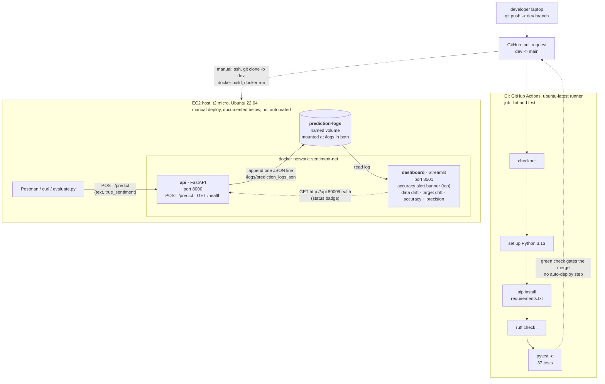

# CI/CD, Testing, and EC2 Deployment (Assignment 6)

The final assignment: the FastAPI service and Streamlit dashboard from Assignment 5
(hw7) get a test suite, an automated GitHub Actions pipeline, and a manual deployment
to a live AWS EC2 host. Same model as Assignments 1, 3, and 5
(`sentiment_model.pkl`, TF-IDF + Multinomial Naive Bayes). Nothing in the served
application changed this week. The additions are the tests, the workflow, and this
operational manual.

- Week: 8
- Topic: CI/CD (GitHub Actions), testing, and manual EC2 deployment
- Partner: solo
- Points: 17 per the assignment brief
- Due: `8/18/2026 11:59 PM` per the brief header

Per the brief's own submission instructions, grading of Part 3 works by replication,
not observation: the instructor will not check a live EC2 instance, since it will not
persist once closed. Instead the "Manual deployment to EC2" section below is written
to be followed verbatim, by a reader with a fresh key pair and nothing else, on the
instructor's own instance.

---

## For the grader

Two independent checks. The automated one runs on every pull request. The local one
runs the same stack hw7 shipped, now with 37 tests behind it.

```bash
cd assignments/hw8
python3 -m venv .venv && .venv/bin/pip install --require-hashes -r requirements.txt
.venv/bin/python -m pytest -q      # 37 passed
make build
make run
curl http://localhost:8000/health  # {"status":"ok"}
.venv/bin/python evaluate.py       # scores the API over the instructor's 174-record test set
open http://localhost:8501         # the monitoring dashboard
make clean
```

CI runs automatically on the pull request from `dev` to `main`. A throwaway pull
request against this exact commit history confirmed the workflow end to end:
[run 30729295834](https://github.com/rocklambros/MLOPS-Comp-4450-1/actions/runs/30729295834),
job `lint and test`, conclusion `success`. Ruff reported `All checks passed!`. Pytest
reported `37 passed in 5.34s` on the `ubuntu-latest` runner, matching the 37 tests
collected locally on macOS arm64 (`.venv/bin/python -m pytest --collect-only -q` →
`37 tests collected`: 24 in `api/test_api.py`, 6 in `monitoring/test_dashboard.py`, 7
in `monitoring/test_reference_stats.py`).

Running `evaluate.py` for this README against a freshly built local stack, on
2026-08-01, over the instructor's `test.json` (174 rows, 87 positive / 87 negative):

```
====================================================
Scored          : 174 of 174
Correct         : 165
ACCURACY        : 94.83%
Precision (neg) : 94.32%
Precision (pos) : 95.35%
Predicted mix   : {'positive': 86, 'negative': 88}
====================================================
```

This is a fresh run performed for this task, not a figure carried over from hw7's
README. It reads the same because it is the same model, the same test set, and the
same `/predict` code path hw7 shipped. hw8 adds tests and deployment tooling around
that path without changing it.

## System architecture



The course's CI/CD model has five stages: Source and Commit, Build, Test, Deploy, and
Monitor and Feedback. hw8 automates the path from Source/Commit through Test: a push
to `dev` and a pull request against `main` trigger the GitHub Actions job, which
installs the pinned dependencies, lints with ruff, and runs the 37-test suite. Deploy
is not automated. Getting the code onto the EC2 host, building the two images, and
running the containers is the documented manual procedure below, carried out by a
human at a terminal.

This is continuous integration plus a documented manual deploy, not continuous
deployment. The course defines continuous deployment as pushing every change that
passes the pipeline straight to production "without any human intervention," and Part
3 of this brief asks for a manual deployment guide on the same page, which is the
opposite of that definition. Monitor and Feedback is the Streamlit dashboard carried
over from hw7, reading the shared volume once both containers are running on the host.

## Files

```
assignments/hw8/
├── docker-compose.yml            local dev only: shared volume + network, two services
├── Makefile                      build · run · seed · evaluate · test · clean
├── evaluate.py                   scores the running API, prints a final accuracy
├── test.json                     instructor's test set, 174 rows (87 pos / 87 neg)
├── test_data.json                identical copy, so both names the brief uses resolve
├── pytest.ini                    warnings-as-errors across the whole suite
├── pyproject.toml                ruff config: E, W, F, I, B, UP; line-length 100; py313
├── requirements.in               root dependency source: both service stacks + pytest, httpx, ruff
├── requirements.txt              the same, compiled and hash-pinned (what CI installs)
├── week8_Assignment6CICDTesting.md / .pdf   the released brief
├── README.md                     this file
│
├── api/                          the FastAPI prediction service
│   ├── main.py                   POST /predict (logs every call) · GET /health
│   ├── Dockerfile                python:3.13-slim (digest-pinned), non-root, /logs
│   ├── sentiment_model.pkl       the Assignment 1 model, byte-identical to hw1's
│   ├── requirements.in           serving stack (source)
│   ├── requirements.txt          the same, compiled and hash-pinned
│   ├── conftest.py               puts the app dir on sys.path for tests
│   └── test_api.py               24 tests pinning the logging contract, 422/413/503
│
└── monitoring/                   the Streamlit monitoring dashboard
    ├── dashboard.py              alert banner, data drift, target drift, accuracy
    ├── reference_stats.py        drift reference: build · load · resolve
    ├── reference_stats.json      the 11 KB reference that ships in the image
    ├── imdb_sample.csv           200-row fallback if the artifact is ever absent
    ├── Dockerfile                python:3.13-slim (digest-pinned), non-root, /logs
    ├── requirements.in           streamlit + pandas + matplotlib + requests (source)
    ├── requirements.txt          the same, compiled and hash-pinned
    ├── conftest.py               puts the app dir on sys.path for tests
    ├── test_dashboard.py         6 tests: launch, alert, no-feedback, empty log, boot
    └── test_reference_stats.py   7 tests pinning reference-artifact equivalence
```

The `.github/workflows/ci.yml` that drives the pipeline lives at the repository root,
not under `assignments/hw8/`, because GitHub reads workflows only from that path.

## Local development

### Using make

```bash
cd assignments/hw8
make build     # builds sentiment-monitor-api and sentiment-monitor-dashboard
make run       # creates the volume + network, starts both containers detached
```

`make build` completed clean on arm64 in 27.8 seconds, no `--platform` flag needed
(the digest-pinned base resolves multi-arch correctly). `make run` reports both
service URLs:

```
  API       http://localhost:8000/docs
  Dashboard http://localhost:8501
```

Confirm both are up, run the test suite, then send some traffic:

```bash
curl http://localhost:8000/health   # {"status":"ok"}
make test                           # 37 passed
make seed                           # five labeled predictions
make evaluate                       # scores the API over the 174-record test set
```

`make test` and `make evaluate` need the host venv from the grader block above.
`make evaluate` runs `evaluate.py`, whose real output for this task is in the "For the
grader" section.

Tear everything down before switching to the raw `docker` path below, since both
paths use the same fixed container, volume, and network names and the second
collides with the first if it is still running:

```bash
make clean      # stops both containers, drops the volume, the network, both images
```

### The raw docker equivalent

For a grader who skips `make` and Compose. Free the fixed names first if the stack
above is still up:

```bash
docker rm -f sentiment-monitor-api sentiment-monitor-dashboard 2>/dev/null || true
docker volume rm prediction-logs 2>/dev/null || true
docker network rm sentiment-net 2>/dev/null || true
```

Then build and run by hand:

```bash
docker network create sentiment-net
docker volume create prediction-logs

docker build -t sentiment-monitor-api ./api
docker build -t sentiment-monitor-dashboard ./monitoring

docker run -d --name sentiment-monitor-api \
  --network sentiment-net -p 8000:8000 \
  -v prediction-logs:/logs sentiment-monitor-api

docker run -d --name sentiment-monitor-dashboard \
  --network sentiment-net -p 8501:8501 \
  -v prediction-logs:/logs -e API_URL=http://sentiment-monitor-api:8000 \
  sentiment-monitor-dashboard
```

With raw `docker run` the service DNS name is the `--name`, so the dashboard points
at `http://sentiment-monitor-api:8000`. Under Compose or `make`, it is the service
name, `http://api:8000`. Tear down the same way as the `make clean` step above.

## Continuous integration (GitHub Actions)

The workflow lives at `.github/workflows/ci.yml` at the repository root, the only
place GitHub reads workflows from. It triggers on every pull request opened or
updated against `main`, with no path filter, so the check is visible on the graded
pull request regardless of which files changed.

One job, `lint and test`, runs on `ubuntu-latest` with a 15-minute timeout and reads
the repository only (`permissions: contents: read`). Every step sets
`working-directory: assignments/hw8`, so pytest's rootdir picks up hw8's `pytest.ini`
and its `filterwarnings = error` gate. The five steps run in the brief's stated order:

1. Check out the repository. `actions/checkout` pinned to the commit SHA behind tag
   `v4.2.2`, `persist-credentials: false` so no step can push with the job token.
2. Set up Python 3.13. `actions/setup-python` pinned to the commit SHA behind tag
   `v5.3.0`.
3. `pip install --require-hashes -r requirements.txt`.
4. `ruff check .`.
5. `pytest -q`.

Both pinned SHAs were checked against their claimed tags with
`git ls-remote --tags` before the workflow was written.

Verified green on a throwaway pull request built from this exact commit history:
[run 30729295834](https://github.com/rocklambros/MLOPS-Comp-4450-1/actions/runs/30729295834).
Overall conclusion `success`, job wall time 42 seconds. Ruff: `All checks passed!`.
Pytest: `37 passed in 5.34s`. The one Streamlit subprocess test that starts a real
server, the predicted likely failure point on a Linux runner, passed without
incident.

## Manual deployment to EC2

Written for a reader who has just downloaded a fresh key pair and has nothing else.
Every host reference reads `<EC2_PUBLIC_IP>` literally. Substitute the instance's
own public IP at each step.

1. Launch the instance
   - AMI: Ubuntu Server 22.04 LTS
   - Instance type: t2.micro
   - Key pair: create or select one, download the .pem
   - Security group inbound rules:

     | Type       | Port | Source        |
     |------------|------|---------------|
     | SSH        | 22   | My IP         |
     | Custom TCP | 8000 | Anywhere-IPv4 |
     | Custom TCP | 8501 | Anywhere-IPv4 |

2. Protect the key. A freshly downloaded .pem is world-readable and SSH refuses it.
   ```bash
   chmod 400 <key>.pem
   ```

3. Connect.
   ```bash
   ssh -i <key>.pem ubuntu@<EC2_PUBLIC_IP>
   ```

4. Install Docker and Git.
   ```bash
   sudo apt-get update
   sudo apt-get install -y docker.io git
   sudo systemctl enable --now docker
   ```

5. Grant docker access, then reload the group. Group membership does not apply to the
   current shell, so skipping this fails the first build with a socket permission
   error.
   ```bash
   sudo usermod -aG docker ubuntu
   newgrp docker
   docker ps
   ```

6. Get the code onto the host. Pick ONE path, then set `APP_DIR` to match.

   Path A, scp. No credential ever lands on the box. Run this on your laptop:
   ```bash
   scp -i <key>.pem -r assignments/hw8 ubuntu@<EC2_PUBLIC_IP>:/home/ubuntu/hw8
   ```
   Then on the instance:
   ```bash
   export APP_DIR=/home/ubuntu/hw8
   ```

   Path B, clone. This is what Part 3's "Clone your GitHub repository onto the EC2
   instance" describes. `-b dev` is required: the pull request stays unmerged for
   grading, so `main` carries no hw8 code. The repository is private, so this prompts
   for a GitHub username and a personal access token as the password.
   ```bash
   git clone -b dev https://github.com/rocklambros/MLOPS-Comp-4450-1.git
   export APP_DIR=/home/ubuntu/MLOPS-Comp-4450-1/assignments/hw8
   ```
   If you use Path B, revoke the token when finished. A token typed on a shared
   sandbox host outlives the instance.

7. Create the shared network. The brief mandates a volume and never mentions a
   network, yet the dashboard resolves the API by container name, which the default
   bridge does not provide. Without this the stack looks healthy and the API badge
   reads unreachable.
   ```bash
   docker network create sentiment-net
   ```

8. Create the shared volume.
   ```bash
   docker volume create prediction-logs
   ```

9. Build both images.
   ```bash
   cd "$APP_DIR"
   docker build -t sentiment-monitor-api ./api
   docker builder prune -f
   docker build -t sentiment-monitor-dashboard ./monitoring
   ```

10. Run both containers detached on the shared volume and network.
    ```bash
    docker run -d --name sentiment-monitor-api \
      --network sentiment-net \
      -p 8000:8000 \
      -v prediction-logs:/logs \
      --restart unless-stopped \
      sentiment-monitor-api

    docker run -d --name sentiment-monitor-dashboard \
      --network sentiment-net \
      -p 8501:8501 \
      -v prediction-logs:/logs \
      -e API_URL=http://sentiment-monitor-api:8000 \
      --restart unless-stopped \
      sentiment-monitor-dashboard
    ```
    `API_URL` is the CONTAINER name here. Compose uses the service name `api`, and
    copying that value into this path breaks the dashboard's health badge.

11. Seed the log so the dashboard has data. Without this the grader opens port 8501
    and sees "No predictions logged yet" and nothing else.
    ```bash
    curl -fsS -X POST http://<EC2_PUBLIC_IP>:8000/predict \
      -H 'Content-Type: application/json' \
      -d '{"text": "An absolute masterpiece, I loved every minute of it.", "true_sentiment": "positive"}'
    curl -fsS -X POST http://<EC2_PUBLIC_IP>:8000/predict \
      -H 'Content-Type: application/json' \
      -d '{"text": "A boring, painful waste of two hours.", "true_sentiment": "negative"}'
    ```

12. Verify. Check `/predict`, not only `/health`: a mis-copied model yields a
    container that passes `docker ps` and `GET /health` while returning 503 on
    `/predict`.
    ```bash
    docker ps
    curl -fsS http://<EC2_PUBLIC_IP>:8000/health
    curl -fsS -X POST http://<EC2_PUBLIC_IP>:8000/predict \
      -H 'Content-Type: application/json' \
      -d '{"text": "A boring, painful waste of two hours.", "true_sentiment": "negative"}'
    ```
    Expected: `{"status":"ok"}` from the second, and a 200 carrying
    `predicted_sentiment` from the third. Then open `http://<EC2_PUBLIC_IP>:8501` and
    confirm the charts render.

    Optional fuller check, scoring the API over the 174-record labeled set:
    ```bash
    sudo apt-get install -y python3-pip
    # --break-system-packages is required on Ubuntu 24.04 (PEP 668 blocks a bare
    # pip3 install into the system Python) and is a harmless no-op on 22.04.
    pip3 install --break-system-packages requests
    python3 evaluate.py --api-url http://<EC2_PUBLIC_IP>:8000
    ```

13. Tear down when finished.
    ```bash
    docker rm -f sentiment-monitor-api sentiment-monitor-dashboard
    docker volume rm prediction-logs
    docker network rm sentiment-net
    ```
    Then terminate the instance in the console. Leaving it running leaves an
    unauthenticated service exposed to the internet.

## Requirement-to-evidence map

Every task in the brief, where it is implemented, and how to check it. No row claims
more than its listed command proves.

| # | Requirement (from the brief) | Where | How to verify |
|---|---|---|---|
| 1 | `POST /predict` tested with a positive and a negative example | `api/test_api.py:229`, `:241` | `pytest api/test_api.py -k classifies -v` |
| 2 | `/predict` correctly handles missing or malformed data | `api/test_api.py:133` (parametrized 422s), `:162` (413), `:203` (503), `:252` | `pytest api/test_api.py -v` |
| 3 | Dashboard test: launches without errors | `monitoring/test_dashboard.py:97` | `pytest monitoring/test_dashboard.py::test_dashboard_launches_without_errors -v`. Runs `AppTest`, which never binds a port. It proves the script executes without raising and renders a success banner, not that a real server socket opens. |
| 3b | Dashboard test: the process actually boots and serves traffic | `monitoring/test_dashboard.py:184` | `pytest monitoring/test_dashboard.py::test_streamlit_server_boots_and_serves_health -v`. Starts a real Streamlit subprocess and polls `/_stcore/health`. Proves the server boots, not that the page rendered. |
| 4 | Work done on a `dev` branch, `main` protected | this repository's `dev` branch, this commit | `git branch --show-current` |
| 5 | `.github/workflows/` directory with a CI YAML file | `.github/workflows/ci.yml` (repo root) | `cat .github/workflows/ci.yml` |
| 6 | Trigger: PR opened or updated against `main` | `ci.yml` `on: pull_request: branches: [main]` | `grep -A2 '^on:' ../../.github/workflows/ci.yml` |
| 7 | Job runs on an Ubuntu runner | `ci.yml` `runs-on: ubuntu-latest` | the CI run link above, "Set up job" step |
| 8 | Steps in order: checkout, set up Python, install deps, lint, test | `ci.yml` steps 1-5 | the CI run link above, per-step conclusions all `success` |
| 9 | Launch a t2.micro EC2 instance running Ubuntu | ["Manual deployment to EC2", step 1](#manual-deployment-to-ec2) | follow step 1 on a fresh AWS account |
| 10 | Security group: 22 from My IP, 8000 and 8501 from anywhere | step 1's table | `aws ec2 describe-security-groups` on the created group, or the console |
| 11 | Connect over SSH | step 3 | `ssh -i <key>.pem ubuntu@<EC2_PUBLIC_IP>` succeeds |
| 12 | Install Docker and Git on the instance | steps 4-5 | `docker --version && git --version` on the instance |
| 13 | Clone the repository, create a shared volume, build both images, run both containers detached and connected to the volume | steps 6-10 | `docker ps` shows both containers `Up`, `docker volume inspect prediction-logs` shows both container names attached |
| 14 | README describes the architecture: FastAPI, Streamlit, CI/CD pipeline, EC2 deployment | ["System architecture"](#system-architecture) | Mermaid diagram covers all four. The paragraph below it names the automated and manual halves |
| 15 | README explains local build and run with Docker | ["Local development"](#local-development) | `make` path and raw `docker` path, teardown between |
| 16 | README gives a very detailed manual deployment guide | ["Manual deployment to EC2"](#manual-deployment-to-ec2) | 13 numbered steps, key pair to teardown, copy-pasteable |

## Deviations from the brief

- **Monorepo, private, not a new public repository.** The brief says "create a new
  repository for this assignment." Permission to keep using this monorepo instead,
  and to keep it private, was granted verbally in class. The instructor
  (`navido89`) has push access as a collaborator. This deviation was already in
  effect for hw7 and every assignment before it.
- **Python 3.13, not the course's stated 3.9.** Carried forward from hw2 onward.
  pandas 3.0.3 and scikit-learn 1.9.0 need Python 3.10+, and the model was pickled
  under 3.13. Rationale and the offer to re-pin live in `COURSE_STATE.md`.
- **ruff, not flake8.** The brief names flake8 as an example ("a linter like flake8
  or ruff"), so either satisfies the requirement. ruff is faster and covers pyflakes,
  pycodestyle, import sorting, bugbear, and pyupgrade in one tool
  (`pyproject.toml`).
- **The workflow lives at the repository root**, not under `assignments/hw8/`.
  GitHub Actions only discovers workflows in `.github/workflows/` at the repo root,
  so there was no alternative that still triggers.
- **CI, not CD.** The pipeline automates lint and test on every pull request. It does
  not deploy anything automatically. Part 3's deployment is the manual procedure
  above, matching what the brief itself asks for.
- **GitHub Actions pinned to commit SHAs, not tags.** `actions/checkout` and
  `actions/setup-python` are pinned to the commit behind their release tag rather
  than the tag itself, so a moved tag cannot change what the job runs.
- **Two HTTP status codes beyond the course's taught vocabulary: 413 and 503.** 413
  covers an oversized request body. 503 covers a missing or corrupt model file at
  `/predict`. Neither is required by this brief. Both are real degraded-mode paths
  carried over from hw3 and hw7, and both are exercised by the "handles malformed
  data" tests Part 1 asks for.

## Limitations

Neither service on the EC2 host is authenticated. This is the configuration the
brief specifies: open both ports "from anywhere."

- **Inbound.** Anyone who reaches port 8000 can call `/predict`. The only bounds are
  the 1 MiB raw body cap and the 20,000-character text cap. There is no rate limit
  and no API key.
- **Outbound.** Port 8501 serves an unauthenticated read of the monitoring surface.
  Scoped precisely: `monitoring/dashboard.py:326` renders exactly
  `["timestamp", "predicted_sentiment", "true_sentiment", "length"]` in the recent-
  predictions table. `request_text`, the actual review submitted, is **not** in that
  list and is never rendered anywhere on the dashboard. What an anonymous visitor to
  port 8501 can observe is prediction volume, request timing, the predicted and
  true label mix, and per-request text length, not the review content itself.
- **Plain HTTP.** Both ports serve unencrypted traffic. Week 3's networking material
  calls HTTPS "essential for protecting data in transit," and this deployment
  contradicts that guidance. It is the configuration the brief specifies, with no
  TLS termination anywhere in the stack.
- **Deliberately absent: S3, DynamoDB, an IAM instance profile.** The brief's Part 3
  says only "Clone your GitHub repository onto the EC2 instance," and the model
  ships inside the repository (`api/sentiment_model.pkl`), so there is nothing for
  the instance to fetch from AWS storage. Adding an instance profile here would be
  unused permissions on a host the brief already treats as disposable.

## Running the tests

```bash
python3 -m venv .venv && .venv/bin/pip install --require-hashes -r requirements.txt
.venv/bin/python -m pytest -q
# 37 passed
```

`pytest.ini` treats warnings as errors, with one allowlisted third-party deprecation
(starlette's TestClient httpx warning, inherited from hw7). 24 API tests pin the
logging contract field by field, the newline-delimited format, every 422 path, the
413 ceiling, and the 503 degraded mode. 6 dashboard tests cover the required launch
check, the accuracy alert, the no-feedback and empty-log states, the pinned 80
percent threshold, and a real subprocess boot. 7 reference-stats tests pin that the
dashboard's drift reference reproduces exactly from the raw IMDB CSV, unchanged from
hw7.
